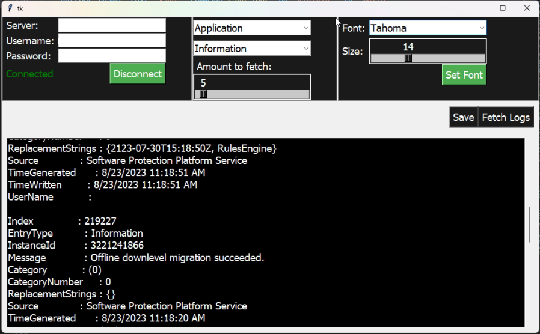

  # Event Log Viewer 📝  
  Simple Python script to connec to your Windows server and retrieve logs.  
  
  ##

  ## Get Started 🚀
  
  To get started, follow these steps:
  - open a terminal or command window
  - cd to the folder you saved the script
  (example: cd event_log_viewer)
  - type this and press enter:  python main.py

  When the app starts up, fill in the information and click connect.
  ##
  ## Info🔥  
  For security, I did not add a function to save credentials. Add it if you wish, but ensure to incorporate some sort of encryption or some other security method.
      
  ## Features ✨  
  - Connect remotely
  - Select from available logs
  - Choose the type of entries
  - Display up to 100 entries at a time
  - Use any installed font, set to size
  - Save logs locally

## License  
[MIT](https://choosealicense.com/licenses/mit/)  

## Screenshots  
  
